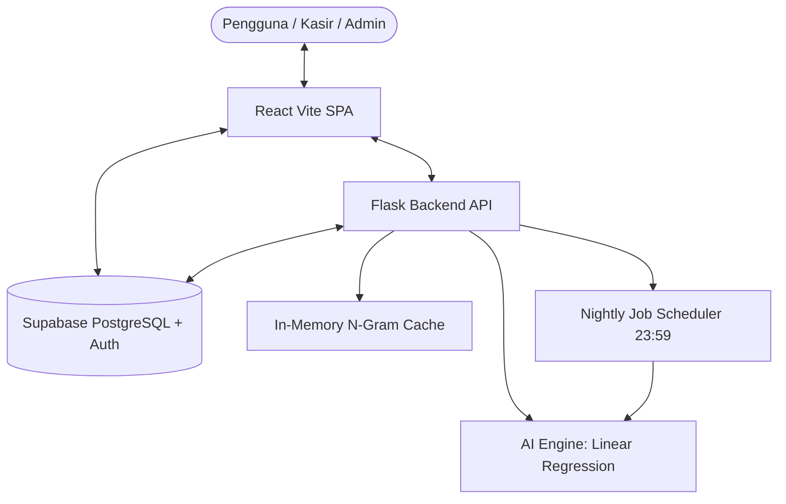

# ☕ Ogut Coffee - Point of Sale (POS) & AI Forecasting System

[](https://react.dev/)
[](https://flask.palletsprojects.com/)
[](https://supabase.com/)
[](https://tailwindcss.com/)
[](https://scikit-learn.org/)

Sistem kasir modern (*Point of Sale*) terintegrasi kecerdasan buatan (*Machine Learning*) untuk manajemen operasional kedai kopi **Ogut Coffee**. Dilengkapi antarmuka kasir yang responsif, manajemen inventaris real-time, pencatatan log aktivitas, riwayat transaksi, serta modul prediksi kebutuhan stok dan tren penjualan menggunakan **Linear Regression**.

---

## 📌 Daftar Isi
- [Ikhtisar Proyek](#-ikhtisar-proyek)
- [Teknologi yang Digunakan (Tech Stack)](#-teknologi-yang-digunakan-tech-stack)
- [Fitur Utama](#-fitur-utama)
- [Arsitektur Sistem & Modul AI](#-arsitektur-sistem--modul-ai)
- [Struktur Direktori](#-struktur-direktori)
- [Panduan Instalasi & Menjalankan Sistem](#-panduan-instalasi--menjalankan-sistem)
  - [1. Prasyarat](#1-prasyarat)
  - [2. Konfigurasi Database (Supabase)](#2-konfigurasi-database-supabase)
  - [3. Instalasi & Menjalankan Backend (Flask)](#3-instalasi--menjalankan-backend-flask)
  - [4. Instalasi & Menjalankan Frontend (React + Vite)](#4-instalasi--menjalankan-frontend-react--vite)
- [Konfigurasi Environment Variables](#-konfigurasi-environment-variables)
- [Daftar Endpoint API](#-daftar-endpoint-api)

---

## 📖 Ikhtisar Proyek

Ogut Coffee POS System dirancang untuk menjawab tantangan operasional kedai kopi modern:
1. **Kecepatan & Akurasi Transaksi**: Kasir dapat memproses pesanan dengan kalkulasi otomatis, validasi stok instan, dan multi-metode pembayaran.
2. **Otomatisasi Inventaris**: Pengurangan stok bahan baku dan menu secara real-time disertai log mutasi stok.
3. **Analitik Cerdas & Peramalan**: Modul AI berbasis **Linear Regression** yang menganalisis riwayat transaksi harian dan tren musiman untuk memprediksi volume penjualan mendatang sehingga mencegah *stockout* maupun *overstocking*.
4. **Keamanan & Kontrol Hak Akses (RBAC)**: Pemisahan hak akses antara `admin` (manajemen penuh, audit log, laporan revenue) dan `kasir` (transaksi POS & riwayat pesanan).

---

## 🛠️ Teknologi yang Digunakan (Tech Stack)

### **Frontend**
- **Core Framework**: [React 19](https://react.dev/) + [Vite 8](https://vitejs.dev/)
- **UI Components & Icons**: Radix UI Primitives, Lucide React
- **Styling**: Tailwind CSS, Tailwind Merge, PostCSS
- **State & Routing**: React Router v7, React Context API (AuthContext)
- **Reporting & Export**: jsPDF & jsPDF-AutoTable (Export PDF struk & rekap harian)
- **API & Client**: Supabase JS SDK, Fetch API

### **Backend & AI Engine**
- **Core Framework**: [Flask 3.x](https://flask.palletsprojects.com/) (Python 3.10+)
- **Machine Learning**: [Scikit-Learn](https://scikit-learn.org/) & [NumPy](https://numpy.org/) (Linear Regression Model)
- **In-Memory Cache**: N-Gram Caching Memory untuk optimasi pencarian dan komputasi cepat
- **Task Scheduling**: APScheduler (Background Scheduler untuk batch processing harian pukul 23:59)
- **Security & Middleware**: Werkzeug (Password Hashing), Flask-CORS, PyJWT, Cryptography, Role-Based Session Middleware

### **Database & Authentication**
- **Database Engine**: [Supabase](https://supabase.com/) (PostgreSQL dengan Row Level Security / RLS)
- **Auth**: Supabase Authentication + Session-based IT Admin Dashboard

---

## ✨ Fitur Utama

| Fitur | Deskripsi |
| :--- | :--- |
| **Kasir & Point of Sale** | Katalog menu dinamis, filter kategori, keranjang belanja real-time, perhitungan diskon & pajak, cetak struk PDF. |
| **Manajemen Menu** | Tambah, ubah, nonaktifkan menu, unggah foto produk ke Supabase Storage, dan kelola harga. |
| **Manajemen Inventaris & Log Stok** | Monitoring sisa stok bahan baku, modal restock cepat, serta riwayat audit keluar-masuk stok. |
| **Riwayat Transaksi (Order History)** | Filter pesanan berdasarkan tanggal, status, dan kasir, detail item transaksi, serta pembatalan/refund pesanan. |
| **Rekap Pendapatan Harian** | Modal audit omset harian kasir, total transaksi tunai/non-tunai, dan export laporan PDF. |
| **Audit & Activity Log** | Pencatatan otomatis setiap aktivitas penting sistem untuk keamanan dan akuntabilitas. |
| **Manajemen Pengguna (RBAC)** | Tambah kasir baru, reset password, dan kontrol hak akses peran (*Role-Based Access Control*). |
| **Admin IT & AI Reasoning Dashboard** | Dashboard Flask internal untuk memantau status server, N-Gram RAM stats, pemicu manual AI (*Force Run*), dan log penalaran model. |

---

## 🧠 Arsitektur Sistem & Modul AI



### **Linear Regression Sales Forecasting**
* **Input**: Data agregasi transaksi harian historis (hari, tanggal, tren permintaan produk).
* **Fungsi**: Membentuk garis regresi linear $Y = mX + c$ untuk memproyeksikan estimasi unit produk yang akan terjual pada hari berikutnya.
* **Output**: Estimasi kebutuhan stok, rekomendasi restock bahan baku, dan ringkasan penalaran AI (*AI reasoning logs*).

---

## 📁 Struktur Direktori

```text
ogut-coffee-pos-system/
├── backend-pos/                     # Flask Backend & Layanan AI
│   ├── ai_services/
│   │   └── linear_regression.py     # Modul Machine Learning Linear Regression
│   ├── api/
│   │   ├── auth_routes.py           # API endpoint otentikasi
│   │   └── routes.py                # API endpoint inventaris, transaksi, & AI
│   ├── config/
│   │   └── supabase_client.py       # Inisialisasi koneksi database Supabase
│   ├── memory/
│   │   └── ngram_cache.py           # In-memory N-Gram Cache
│   ├── templates/                   # UI Admin IT internal (Flask Jinja2)
│   ├── app.py                       # Entry point Flask & scheduler
│   ├── requirements.txt             # Dependensi Python
│   └── .env.example                 # Template environment backend
├── frontend/                        # React Vite Single Page Application
│   ├── src/
│   │   ├── components/              # Reusable UI & Layout components
│   │   ├── features/
│   │   │   ├── auth/                # Login & Protected Route
│   │   │   ├── inventory/           # Modal & Layanan Stok
│   │   │   ├── menu/                # Form & Layanan Katalog Menu
│   │   │   ├── orders/              # Riwayat Pesanan & Detail Modal
│   │   │   ├── pos/                 # POS Cashier, Cart, & Checkout
│   │   │   └── users/               # Manajemen Kasir & Pengguna
│   │   ├── lib/                     # Supabase client, logger, pdfExport, utils
│   │   ├── pages/                   # Halaman Dashboard, Kasir, Menu, Stok, dll.
│   │   ├── App.jsx                  # Routing & Provider setup
│   │   └── main.jsx                 # Vite React root
│   ├── package.json                 # Dependensi Node.js
│   └── .env.example                 # Template environment frontend
├── Dokumentasi/                     # Dokumen perancangan, arsitektur, & panduan
├── .gitignore                       # Konfigurasi Git ignore teroptimasi
└── README.md                        # Dokumentasi utama proyek
```

---

## 🚀 Panduan Instalasi & Menjalankan Sistem

### 1. Prasyarat
Pastikan sistem Anda telah terpasang:
- **Node.js**: v18.x atau v20.x+
- **Python**: v3.10 atau v3.11+
- **Git**
- Akun dan project aktif di [Supabase](https://supabase.com)

---

### 2. Konfigurasi Database (Supabase)
1. Buat project baru di dashboard Supabase.
2. Jalankan skema database, tabel (`users`, `products`, `orders`, `order_items`, `inventory_logs`, `activity_logs`), dan fungsi RPC / migrasi SQL yang tersedia di folder `backend-pos/migrations/` atau `Dokumentasi/`.
3. Aktifkan **Supabase Storage bucket** (misal: `menu-images`) dengan akses public/read jika ingin menggunakan fitur foto menu.

---

### 3. Instalasi & Menjalankan Backend (Flask)

1. Masuk ke direktori backend:
   ```bash
   cd backend-pos
   ```

2. Buat virtual environment Python baru:
   ```bash
   # Windows (PowerShell)
   python -m venv venv
   .\venv\Scripts\Activate.ps1

   # Linux / macOS
   python3 -m venv venv
   source venv/bin/activate
   ```

3. Pasang dependensi:
   ```bash
   pip install -r requirements.txt
   ```

4. Salin dan sesuaikan file environment:
   ```bash
   cp .env.example .env
   ```
   *Buka `.env` dan isi `SUPABASE_URL`, `SUPABASE_KEY`, serta kredensial admin.*

5. Jalankan server Flask:
   ```bash
   python app.py
   ```
   *Backend akan berjalan di `http://localhost:5000` (Dashboard Admin IT: `http://localhost:5000/admin/login`).*

---

### 4. Instalasi & Menjalankan Frontend (React + Vite)

1. Buka terminal baru dan masuk ke direktori frontend:
   ```bash
   cd frontend
   ```

2. Pasang dependensi Node:
   ```bash
   npm install
   ```

3. Salin dan sesuaikan file environment:
   ```bash
   cp .env.example .env
   ```
   *Buka `.env` dan isi `VITE_SUPABASE_URL` serta `VITE_SUPABASE_ANON_KEY` sesuai project Supabase Anda.*

4. Jalankan development server:
   ```bash
   npm run dev
   ```
   *Aplikasi web POS akan terbuka di `http://localhost:5173`.*

---

## ⚙️ Konfigurasi Environment Variables

### Backend (`backend-pos/.env`)
| Variabel | Deskripsi | Default / Contoh |
| :--- | :--- | :--- |
| `SUPABASE_URL` | URL endpoint API Supabase project | `https://xxxx.supabase.co` |
| `SUPABASE_KEY` | Service Role Key atau Anon Key Supabase | `eyJh...` |
| `FLASK_SECRET_KEY` | Kunci enkripsi sesi Flask | `kunci_rahasia_anda` |
| `SESSION_TIMEOUT_MINUTES` | Waktu kedaluwarsa sesi admin IT (menit) | `30` |
| `ADMIN_USERNAME` | Username login dashboard admin IT Flask | `admin_it` |
| `ADMIN_PASSWORD_HASH` | Hashed password admin IT (Werkzeug) | `scrypt:...` |

### Frontend (`frontend/.env`)
| Variabel | Deskripsi | Default / Contoh |
| :--- | :--- | :--- |
| `VITE_SUPABASE_URL` | URL project Supabase | `https://xxxx.supabase.co` |
| `VITE_SUPABASE_ANON_KEY` | Public Anon Key Supabase | `eyJh...` |
| `VITE_API_BASE_URL` | URL backend Flask untuk panggilan AI & Admin | `http://localhost:5000` |

---

## 🔌 Daftar Endpoint API Utama

| Method | Endpoint | Deskripsi |
| :--- | :--- | :--- |
| `GET` | `/api/health` | Health check status server backend Flask |
| `GET` | `/api/ai/forecast` | Mendapatkan hasil peramalan penjualan (Linear Regression) |
| `POST` | `/api/ai/train` | Memicu komputasi ulang model regresi linear |
| `GET` | `/admin/dashboard` | Dashboard web admin IT untuk memantau server & scheduler |
| `POST` | `/admin/force-run-ai` | Trigger manual job batch AI malam hari |
| `GET` | `/admin/ngram` | Inspeksi penggunaan RAM in-memory N-Gram cache |
| `GET` | `/admin/ai-reasoning` | Menampilkan riwayat penalaran matematis AI model |

---

## 📄 Lisensi
Hak Cipta © 2026 Ogut Coffee System. Seluruh hak cipta dilindungi undang-undang.
